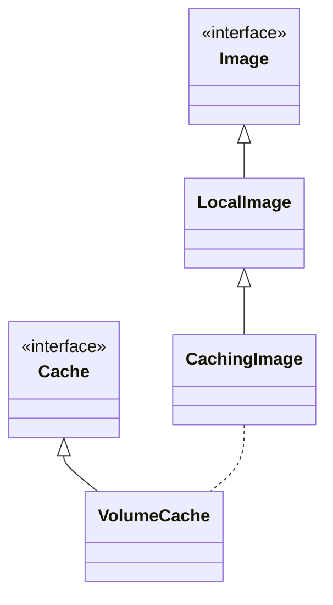
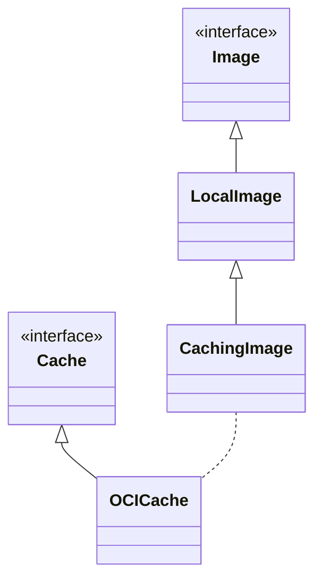

# Meta
[meta]: #meta
- Name: Export to OCI format when daemon is enabled
- Start Date: 2022-02-22
- Author(s): Juan Bustamante (@jbustamante)
- Status: Draft <!-- Acceptable values: Draft, Approved, On Hold, Superseded -->
- RFC Pull Request: (leave blank)
- CNB Pull Request: (leave blank)
- CNB Issue: (leave blank)
- Supersedes: (put "N/A" unless this replaces an existing RFC, then link to that RFC)

# Summary
[summary]: #summary

When the `Exporter` phase is invoked passing the `-daemon` flag  besides writing into the Daemon also save the image to disk in [OCI Layout](https://github.com/opencontainers/image-spec/blob/main/image-layout.md) format updating the [report.toml](https://github.com/buildpacks/spec/blob/main/platform.md#reporttoml-toml) file with all the metadata require to validate the consistency of the image when it is published to a Registry.

# Definitions
[definitions]: #definitions

- A [Platform](https://buildpacks.io/docs/concepts/components/platform/) uses a lifecycle, Buildpacks (packaged in a builder), and application source code to produce an OCI image.
- A [Lifecycle](https://buildpacks.io/docs/concepts/components/lifecycle/) orchestrates Buildpacks execution, then assembles the resulting artifacts into a final app image.
- A Daemon is a service, popularized by Docker, for downloading container images, and executing and managing containers from those images.
- A Registry is a long-running service used for storing and retrieving container images.
- A digest reference refers to a [content addressable](https://en.wikipedia.org/wiki/Content-addressable_storage) identifier of form <registry>/<repo>@<digest> which locates an image manifest in an [OCI Distribution Specification](https://github.com/opencontainers/distribution-spec/blob/master/spec.md) compliant registry.
- A Image Manifest provides a configuration and set of layers for a single container image for a specific architecture and operating system.
- An [OCI Image Layout](https://github.com/opencontainers/image-spec/blob/main/image-layout.md) is the directory structure for OCI content-addressable blobs and location-addressable references.

# Motivation
[motivation]: #motivation

Implementing this new feature will help us to solve the problem of loosing information when the image is saved into the Daemon keeping the image on disk along with the metadata it can be used as input for other tools to offer more capabilities to the end users.

This feature will help to unblock uses cases like
- OCI annotations. See [RFC](https://github.com/buildpacks/rfcs/pull/196)
- Cosign integration. See [RFC](https://github.com/buildpacks/rfcs/pull/195)

# What it is
[what-it-is]: #what-it-is

Currently the *Exporter*  writes either in an OCI image registry or a docker daemon, the idea is to add the capability to write into disk in [OCI Image Layout](https://github.com/opencontainers/image-spec/blob/main/image-layout.md) format only when the `-daemon` flag is used as argument AND the feature is enable using a new flag `-layout` or the default environment variable `CNB_LAYOUT_DIR`.

## Examples

### Exporting using the environment variable

```=shell
> export CNB_LAYOUT_DIR=oci
>  /cnb/lifecycle/exporter -daemon my-app-image
> tree /oci
.
└── oci/
    └── my-app-image/
        ├── blobs/
        │   └── sha256/
        │       └── 01..
        ├── index.json
        └── oci-layout

```

### Exporting using the command line flag

```=shell
>  /cnb/lifecycle/exporter -daemon -layout oci my-app-image
> tree /oci
.
└── oci/
    └── my-app-image/
        ├── blobs/
        │   └── sha256/
        │       └── 01..
        ├── index.json
        └── oci-layout

```
As we can see there is a new folder called `oci` and inside that folder we can find our application image in [OCI Image Layout](https://github.com/opencontainers/image-spec/blob/main/image-layout.md) format

Attempts to use this feature when the `-daemon` flag is not used could be ignore or show some warnings messages.

# How it Works
[how-it-works]: #how-it-works

The lifecycle phases affected by this new behavior is: [Export](https://buildpacks.io/docs/concepts/components/lifecycle/export/)

At high level view of the propose solution can be summarize with the following container diagram from the C4 model


Notice that we are relying on the OCI format Specification to expose the data for `Platforms`

The following new input is proposed to be added to this phase

| Input             | Environment Variable  | Default Value            | Description
|-------------------|-----------------------|--------------------------|----------------------
| `<layout>`      |  `CNB_LAYOUT_DIR` | "" | The root directory where the OCI image will be written. The presence of a none empty value for this environment variable will enable the feature. |


- When the exporter is executed WITH the flag `daemon` it will check for the presence of the flag `layout` or the environment variable `CNB_LAYOUT_DIR`
- IF any of the values are present THEN
  - It will create a folder name `<image>` located at the path defined `<layout>` or `CNB_LAYOUT_DIR`
  - In parallel of exporting the Image to the Daemon it will save the final Image in [OCI Image Layout](https://github.com/opencontainers/image-spec/blob/main/image-layout.md) format in the directory created before. The image will be saved using **uncompressed** layers
  - It will calculate the digest of the manifest of the compressed layers and write that value into the report.toml file
  - It will update the report.toml file with all the tags and require information to verify the image once it is pushed into a registry
- OTHERWISE it will behave as it is right now


# Migration
[migration]: #migration

<!--
This section should document breaks to public API and breaks in compatibility due to this RFC's proposed changes. In addition, it should document the proposed steps that one would need to take to work through these changes. Care should be give to include all applicable personas, such as platform developers, buildpack developers, buildpack users and consumers of buildpack images.
-->
# Drawbacks
[drawbacks]: #drawbacks

- We could increase the disk space if we not managed the duplication of saving the layers on disk. Currently the Cache implementation (used when daemon is ON) saved the layers tarballs on disk, because the current proposal is exporting the whole image on disk it will also require more space to save the layers for the OCI format in the `blobs` folder.

# Alternatives
[alternatives]: #alternatives

## Redesign the current Cache

Another potential solution could be to export the OCI image along with the current Cache concept and expose some contract for `Platform` to interact with this Cache and extract the final OCI image. At high level, the solution can be represented with the following container diagram from C4 model


Notice that on this solution, because the Cache is an internal component from the Lifecycle implementation we will have to expose some kind of specification for `Platforms` to understand its format and been able to read the OCI image.

The current implementation when the Daemon is enable can be describe with the following class diagram



When the Daemon is enabled, a `CachingImage` is created, this image implementation saves the layers tarballs in a `VolumeCache` to reuse them and increase the speed of the process. The idea could be to redesign this `Cache` implementation (VolumeCache) with a new one, maybe a `OCICache` which handles the details to avoid saving the layers tarballs duplicated.


### Drawbacks

- We will have to expose Cache implementation details to the outside world, probably spec those details, for other tools to interact with this exported data

<!--
- Why is this proposal the best?
- What is the impact of not doing this? -->

# Prior Art
[prior-art]: #prior-art

Discuss prior art, both the good and bad.

# Unresolved Questions
[unresolved-questions]: #unresolved-questions

<!--
- What parts of the design do you expect to be resolved before this gets merged?
- What parts of the design do you expect to be resolved through implementation of the feature?
- What related issues do you consider out of scope for this RFC that could be addressed in the future independently of the solution that comes out of this RFC? -->

# Spec. Changes (OPTIONAL)
[spec-changes]: #spec-changes

<!--
Does this RFC entail any proposed changes to the core specifications or extensions? If so, please document changes here.
Examples of a spec. change might be new lifecycle flags, new `buildpack.toml` fields, new fields in the buildpackage label, etc.
This section is not intended to be binding, but as discussion of an RFC unfolds, if spec changes are necessary, they should be documented here. -->
