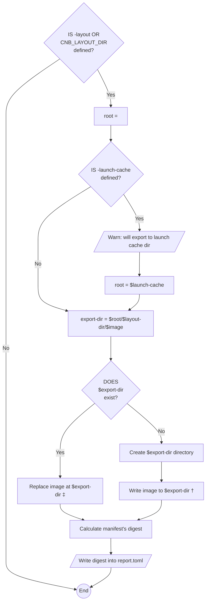

# Meta
[meta]: #meta
- Name: Export to OCI format when daemon is enabled
- Start Date: 2022-02-22
- Author(s): Juan Bustamante (@jbustamante)
- Status: Draft <!-- Acceptable values: Draft, Approved, On Hold, Superseded -->
- RFC Pull Request: (leave blank)
- CNB Pull Request: (leave blank)
- CNB Issue: (leave blank)
- Supersedes: (put "N/A" unless this replaces an existing RFC, then link to that RFC)

# Summary
[summary]: #summary

When the `Exporter` phase is invoked besides writing into the Daemon or a Registry add the capability (enable explicitly by the user) to save the image to disk in [OCI Layout](https://github.com/opencontainers/image-spec/blob/main/image-layout.md) format.

# Definitions
[definitions]: #definitions

- A [Platform](https://buildpacks.io/docs/concepts/components/platform/) uses a lifecycle, Buildpacks (packaged in a builder), and application source code to produce an OCI image.
- A [Lifecycle](https://buildpacks.io/docs/concepts/components/lifecycle/) orchestrates Buildpacks execution, then assembles the resulting artifacts into a final app image.
- A Daemon is a service, popularized by Docker, for downloading container images, and executing and managing containers from those images.
- A Registry is a long-running service used for storing and retrieving container images.
- A digest reference refers to a [content addressable](https://en.wikipedia.org/wiki/Content-addressable_storage) identifier of form <registry>/<repo>@<digest> which locates an image manifest in an [OCI Distribution Specification](https://github.com/opencontainers/distribution-spec/blob/master/spec.md) compliant registry.
- A Image Manifest provides a configuration and set of layers for a single container image for a specific architecture and operating system.
- An [OCI Image Layout](https://github.com/opencontainers/image-spec/blob/main/image-layout.md) is the directory structure for OCI content-addressable blobs and location-addressable references.

# Motivation
[motivation]: #motivation

Implementing this new feature will help us to solve the problem of loosing information when the image is saved into the Daemon keeping the image on disk along with the metadata it can be used as input for other tools to offer more capabilities to the end users.

This feature will help to unblock uses cases like
- OCI annotations. See [RFC](https://github.com/buildpacks/rfcs/pull/196)
- Cosign integration. See [RFC](https://github.com/buildpacks/rfcs/pull/195)

# What it is
[what-it-is]: #what-it-is

Currently the *Exporter*  writes either in an OCI image registry or a docker daemon, the idea is to add the capability to write into disk in [OCI Image Layout](https://github.com/opencontainers/image-spec/blob/main/image-layout.md) format when the new flag `-layout` or the default environment variable `CNB_LAYOUT_DIR` is set.

Let's see some examples of the proposed behavior

## Examples

For each case, I will present two ways of invoking the new feature:

- Using the environment Variable
- Using the new flag

For both ways the expected output is the same

### Exporting to Daemon with launch cache enabled

```=shell
> export CNB_LAYOUT=oci
> /cnb/lifecycle/exporter -daemon -launch-cache /launch-cache my-app-image
```

Or

```=shell
> /cnb/lifecycle/exporter -daemon -launch-cache /launch-cache -layout /oci my-app-image
```

The expected output is the `my-app-image` exported in [OCI Image Layout](https://github.com/opencontainers/image-spec/blob/main/image-layout.md) format into the `/launch-cache/oci/my-app-image/` folder.

```=shell
> cd /launch-cache
> tree .
.
└── launch-cache/
    ├── committed/
    │   ├── io.buildpacks.lifecycle.cache.metadata
    │   ├── sha256:65d9067f915e01...tar
    │   ├── sha256:6905011516dcf4...tar
    │   └── sha256:83d85471d9f8a3...tar
    ├── staging
    └── oci/
        └── my-app-image/
            ├── blobs/
            │   └── sha256/
            │       ├── 65d9067f915e01...tar -> /launch-cache/committed/sha256:65d9067f915e01...tar
            │       ├── 6905011516dcf4...tar -> /launch-cache/committed/sha256:6905011516dcf4...tar
            │       └── 83d85471d9f8a3...tar -> /launch-cache/committed/sha256:83d85471d9f8a3...tar
            ├── index.json
            └── oci-layout

```

### Exporting to Daemon without launch cache enabled

```=shell
> export CNB_LAYOUT=oci
> /cnb/lifecycle/exporter -daemon my-app-image
```

Or

```=shell
>  /cnb/lifecycle/exporter -daemon -layout oci my-app-image
```

The expected output is the `my-app-image` exported in [OCI Image Layout](https://github.com/opencontainers/image-spec/blob/main/image-layout.md) format into the `/oci/` folder

```=shell
cd oci
> tree .
.
└── oci/
    └── my-app-image/
        ├── blobs/
        │   └── sha256/
        │       ├── 65d9067f915e01...tar
        │       ├── 6905011516dcf4...tar
        │       └── 83d85471d9f8a3...tar
        ├── index.json
        └── oci-layout
```

### Exporting to a Registry

```=shell
> export CNB_LAYOUT=oci
> /cnb/lifecycle/exporter gcr.io/my-repo/my-app-image
```

Or

```=shell
>  /cnb/lifecycle/exporter -layout oci gcr.io/my-repo/my-app-image
```

The expected output is the `my-app-image` exported in [OCI Image Layout](https://github.com/opencontainers/image-spec/blob/main/image-layout.md) format into the `/oci/` folder

```=shell
cd oci
> tree .
.
└── oci/
    └── my-app-image/
        ├── blobs/
        │   └── sha256/
        │       ├── 65d9067f915e01...tar
        │       ├── 6905011516dcf4...tar
        │       └── 83d85471d9f8a3...tar
        ├── index.json
        └── oci-layout

```

# How it Works
[how-it-works]: #how-it-works

The lifecycle phase affected by this new behavior is: [Export](https://buildpacks.io/docs/concepts/components/lifecycle/export/)

At high level view the proposed solution can be summarize with the following container diagram from the C4 model


Notice that we are relying on the OCI format Specification to expose the data for `Platforms`

The following new input is proposed to be added to this phase

| Input             | Environment Variable  | Default Value            | Description
|-------------------|-----------------------|--------------------------|----------------------
| `<layout>`      |  `CNB_LAYOUT_DIR` | "" | The root directory where the OCI image will be written. The presence of a none empty value for this environment variable will enable the feature. |

Let's see the proposed flow



Notes **‡**:
  - WHEN `the image exists in the file system`
    - The idea is to use the method [ReplaceImage](https://pkg.go.dev/github.com/google/go-containerregistry/pkg/v1/layout#Path.ReplaceImage). Internally this method uses [WriteImage](https://pkg.go.dev/github.com/google/go-containerregistry/pkg/v1/layout#Path.WriteImage) which will skip to write blobs that already exists. It means the `blobs` directory MAY contain blobs which are not referenced by any of the refs, which is valid according to the OCI image specification.
    - `Platforms` could include a flag to clean the directory if the user desires it

Notes **†**:
  - WHEN `-launch-cache` flow is executed
    - The content of `blobs/<alg>/<encoded>` MAY contain symbolic links to content saved in the launch cache to avoid duplicating files.  
    - The content of `blobs/<alg>/<encoded>` MAY reference tar files in **uncompressed** format because that's how they are saved in the cache
  - WHEN `-launch-cache` IS NOT defined
    - The content of `blobs/<alg>/<encoded>` MAY be saved in **compressed** format

#### `report.toml` (TOML)

The new information to be  added into the `report.toml` file can be summarize as follows:

```toml
[export]
[[export.oci]]
digest = "<image digest>"
manifest-size = "<manifest size in bytes>"
```
Where:
- **If** the app image was exported using the `-layer` flag, the export section will be added to the report
  - `digest` MUST contain the image digest calculated based on compressed layers
  - `manifest-size` MUST contain the manifest size in bytes

# Migration
[migration]: #migration

- No breaking changes were identified

# Drawbacks
[drawbacks]: #drawbacks

- We could increase the disk space if we do not managed the duplication of saving the layers on disk. Currently the Cache implementation (used when daemon is ON) saved the layers tarballs on disk, the proposal is to references those layers in the image exporting on disk to avoid duplication.


# Alternatives
[alternatives]: #alternatives


<!--
- Why is this proposal the best?
- What is the impact of not doing this? -->

# Prior Art
[prior-art]: #prior-art

Discuss prior art, both the good and bad.

# Unresolved Questions
[unresolved-questions]: #unresolved-questions

- Should this change be included on a previous RFC to handle multiple export targets int the Lifecycle?
- Currently the *Launch Cache* saves uncompressed tarballs. Is this by design? Is there any reason for those tarballs to do not be saved compressed?

<!--
- What parts of the design do you expect to be resolved before this gets merged?
- What parts of the design do you expect to be resolved through implementation of the feature?
- What related issues do you consider out of scope for this RFC that could be addressed in the future independently of the solution that comes out of this RFC? -->

# Spec. Changes (OPTIONAL)
[spec-changes]: #spec-changes

<!--
Does this RFC entail any proposed changes to the core specifications or extensions? If so, please document changes here.
Examples of a spec. change might be new lifecycle flags, new `buildpack.toml` fields, new fields in the buildpackage label, etc.
This section is not intended to be binding, but as discussion of an RFC unfolds, if spec changes are necessary, they should be documented here. -->
