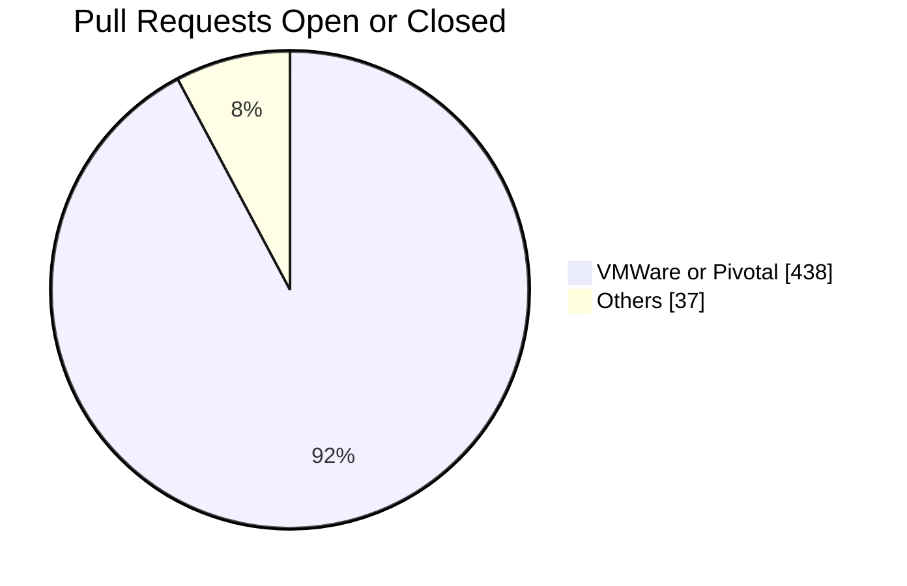

# Meta

- Name: kpack donation to CNB
- Start Date: 2022-06-21
- Author(s): [Juan Bustamante](https://github.com/jjbustamante/)
- Status: Draft
- RFC Pull Request: (leave blank)
- CNB Pull Request: (leave blank)
- CNB Issue: (leave blank)
- Supersedes: (put "N/A" unless this replaces an existing RFC, then link to that RFC)

# Summary

This RFC proposes the donation of the open-source project [kpack](https://github.com/pivotal/kpack/) into the [Cloud Native Buildpacks Community Organization](https://github.com/buildpacks-community) as a vendor neutral staging ground under the CNB governance umbrella. Once the project is deemed sufficiently mature, the project will be moved under the [Cloud Native Buildpacks Organization](https://github.com/buildpacks).

Following the process defined in the [Buildpack Commnity RFC](https://github.com/buildpacks/rfcs/blob/main/text/0117-buildpacks-community.md) the following table presents the criteria used to evaluate the project.

| Criteria                                                                                                                                                                                                                                                                                 | Evidence                                                                                                                                                 |
|------------------------------------------------------------------------------------------------------------------------------------------------------------------------------------------------------------------------------------------------------------------------------------------|----------------------------------------------------------------------------------------------------------------------------------------------------------|
| The project must be a tooling, platform or integration that is related to Cloud Native Buildpacks.                                                                                                                                                                                       | See [Motivation](#motivation) section                                                                                                                    |
| The project must be open source and licensed under Apache 2.0.                                                                                                                                                                                                                           | See [License](https://github.com/pivotal/kpack/blob/main/LICENSE)                                                                                        |
 | List of all external dependencies with licensing info and they’re permissively licensed with a Apache 2.0 compatible license                                                                                                                                                             | See [go-licenses](https://github.com/google/go-licenses) [report](https://drive.google.com/file/d/1SvPdl69Lhn0TTx_TaxcesfajuYY9uiNd/view?usp=share_link) |
| It must follow the Cloud Native Computing Foundation Code of Conduct.                                                                                                                                                                                                                    | See [Code of conduct](https://github.com/pivotal/kpack/blob/main/CODE_OF_CONDUCT.md)                                                                     |
| The project must enable DCO signoff for all commits.                                                                                                                                                                                                                                     | See Sign-off process [Pull Request](https://github.com/pivotal/kpack/pull/1149)                                                                          |
| The project must be open to contributions and have a public issue tracker.                                                                                                                                                                                                               | See public [issue tracker](https://github.com/pivotal/kpack/issues)                                                                                      |
| The project must have a governance document that clearly defines the project maintainers and how they are elected. Each project may choose to define their own governance model as long as it is clearly documented and allows for project maintainers to be elected from the community. ||
| The list of project maintainers must be publicly available and controlled through a Github team.                                                                                                                                                                                         ||
| The project must use a CODEOWNERS file to define the maintainers for each repository. The CODEOWNERS file should reference the Github team that controls the list of maintainers.                                                                                                        | See [CODEOWNERS](https://github.com/pivotal/kpack/blob/main/CODEOWNERS) file                                                                             |
| All project contributors must be members of the Buildpacks community organization.                                                                                                                                                                                                       | See [Team Roles](#team-roles) section and [People](https://github.com/orgs/buildpacks-community/people) in CNB community organization                    |
| The project must be actively maintained (i.e. issues and pull requests must be addressed regularly, approved pull requests must be merged or updated in a timely manner, etc.).                                                                                                          | See [issues](https://github.com/pivotal/kpack/issues) and [pull requests](https://github.com/pivotal/kpack/pulls)                                        |
| There should have visible automated testing for all repositories that are part of the project.                                                                                                                                                                                           | See [codecov](https://app.codecov.io/gh/pivotal/kpack)                                                                                                   |
| The project maintainers must conform to a set of best effort SLOs around patching critical CVEs when applicable to the project.                                                                                                                                                          ||
| The has a file - CONTRIBUTING.md: A guide to how contributors should submit patches and the expectations around code review.                                                                                                                                                             | See Contributing [Pull Request](https://github.com/pivotal/kpack/pull/1149)                                                                              |
| The has a file - DEVELOPMENT.md: A guide to how contributors should develop the project.                                                                                                                                                                                                 | See [Development](https://github.com/pivotal/kpack/blob/main/DEVELOPMENT.md)                                                                             |                                                               
| The has a file - ADOPTERS.md: A list of adopters of the project.                                                                                                                                                                                                                         | See [Adopters](https://github.com/pivotal/kpack/blob/main/ADOPTERS.md)                                                                                   |                                                             
| The has a file - VERSIONING.md: A guide to how versioning is done for the project.                                                                                                                                                                                                       | See [Versioning](https://github.com/pivotal/kpack/blob/main/VERSIONING.md)                                                                               |                                                           
| The has a file - RELEASE.md: A guide to how releases are done for the project.                                                                                                                                                                                                           | See Release [Pull Request](https://github.com/pivotal/kpack/pull/1216)                                                                                   |                                                         
| The has a file - SECURITY.md: A guide to how security vulnerabilities should be reported.                                                                                                                                                                                                | See Security [Pull Request](https://github.com/pivotal/kpack/pull/1149)                                                                                  |

# Definitions

- [Kubernetes](https://kubernetes.io/) is an open-source system for automating deployment, scaling, and management of containerized applications.
- [Kpack](https://github.com/pivotal/kpack/) is a VMware-led open-source project that utilizes [Kubernetes](https://kubernetes.io/) primitives to build OCI images as a [platform](https://buildpacks.io/docs/concepts/components/platform/) implementation of [Cloud Native Buildpacks](https://buildpacks.io/).
- A Kubernetes native application is an application designed to run on Kubernetes platforms, managed by Kubernetes APIs and `kubectl` tooling and cohesively deployed on Kubernetes as a single object.

# Motivation

### Why should we do this?

It will benefit the [CNB](https://buildpacks.io/) project by adding a tool to support an out-of-the box [Kubernetes](https://kubernetes.io/) integration, which is part of the [CNB](https://buildpacks.io/) [roadmap](https://github.com/buildpacks/community/blob/main/ROADMAP.md#integration-with-the-cloud-native-ecosystem) goals.

It will show evidence to the community that the project supports multiple [platform interface specification](https://github.com/buildpacks/spec/blob/main/platform.md) implementers increasing community's confidence on the flexibility of specification maintained by the [CNB](https://buildpacks.io/) project.

It will help the [CNB](https://buildpacks.io/) community (+550 members on slack channel) to grow by adding all the [kpack](https://github.com/pivotal/kpack/) community into [CNB](https://buildpacks.io/) space.

[CNB](https://buildpacks.io/) is part of the [Cloud Native Computing Foundation](https://www.cncf.io), an open source, vendor neutral hub of cloud native computing projects, the inclusion of [kpack](https://github.com/pivotal/kpack/) under this umbrella will provide more opportunity to the community:

- Increase in adopters, users looking to use buildpacks in [Kubernetes](https://kubernetes.io/) will find a tool supported and maintained by the [CNB team](https://github.com/buildpacks/community/blob/main/TEAMS.md).
- Improve efficiency, ensuring that the roadmaps of the two projects are closer aligned will make it easier to coordinate efforts between both communities.

### What use cases does it support?

[kpack](https://github.com/pivotal/kpack/)  will add support to operators by providing declarative [Kubernetes](https://kubernetes.io/) resources (images, builders, or stacks for example) to monitor for security patches on the underlying builder's buildpacks or stacks and rebuild the OCI image when changes are detected, allowing platforms to roll out new versions of the applications when vulnerabilities are fixed.

### How does kpack support the goals and use cases of the project?

The [CNB](https://buildpacks.io/) project turns application source code into OCI-compliant container images; in order to do that, it defines a platform-to-buildpack contract that guarantees interoperability between different implementers.

The [CNB](https://buildpacks.io/) project embraces modern container standards, and [Kubernetes](https://kubernetes.io/) has become the industry standard for automating deployment, scaling, and management of containerized applications.

[kpack](https://github.com/pivotal/kpack/) fits perfectly in that direction because it implements the [platform interface specification](https://github.com/buildpacks/spec/blob/main/platform.md) and because is a [Kubernetes](https://kubernetes.io/) native application its community possesses a vast knowledge that can provide valuable feedback to the CNB project.

### Is there functionality in kpack that is already provided by the project?

[pack](https://github.com/buildpacks/pack) and [kpack](https://github.com/pivotal/kpack/) offer similar functionality (both tools implement the [platform interface](https://github.com/buildpacks/spec/blob/main/platform.md)[specification](https://github.com/buildpacks/spec/blob/main/platform.md)) but they do it for two non-overlapping contexts: while the first one targets developers and local builds, [kpack](https://github.com/pivotal/kpack/) manages containerization on day-2 and at scale and is a [Kubernetes](https://kubernetes.io/) native implementation.

### Is kpack integrated with another service or technology that is widely used?

As mentioned earlier, [kpack](https://github.com/pivotal/kpack/) implements the [platform interface specification](https://github.com/buildpacks/spec/blob/main/platform.md) on [Kubernetes](https://kubernetes.io/), a standard nowadays for automating deployment, scaling, and management of containerized applications.

# What it is

[Kubernetes](https://kubernetes.io/docs/concepts/overview/what-is-kubernetes/) is a portable, extensible, open-source platform for managing containerized workloads and services. The [Kubernetes](https://kubernetes.io/docs/concepts/overview/what-is-kubernetes/) API can be extended in different ways; one of them is using [custom resources](https://kubernetes.io/docs/concepts/extend-kubernetes/api-extension/custom-resources/), a custom resource represents a customization of a particular [Kubernetes](https://kubernetes.io/docs/concepts/overview/what-is-kubernetes/) installation.

[kpack](https://github.com/pivotal/kpack/) extends [Kubernetes](https://kubernetes.io/) using [custom resources](https://kubernetes.io/docs/concepts/extend-kubernetes/api-extension/custom-resources/) and utilizes unprivileged [Kubernetes](https://kubernetes.io/) primitives to provide builds of OCI images as a platform implementation of [Cloud Native Buildpacks](https://buildpacks.io/). This means that [kpack](https://github.com/pivotal/kpack/) takes the CNB-defined concepts (image, builder, stacks, etc) and bakes them into the Kubernetes extension model using custom resources and exposing a declarative API for interacting with it.

The declarative API enforces a separation of responsibilities. Operators declare the configuration for a CNB image or define which buildpacks or stacks must be used, and [kpack](https://github.com/pivotal/kpack/) - using its custom controller - will take care of the heavy lifting, keeping the state of the custom objects in sync with the declared desired state.

# How it Works

As mentioned before, [kpack](https://github.com/pivotal/kpack/) uses the [custom resource](https://kubernetes.io/docs/concepts/extend-kubernetes/api-extension/custom-resources/) extension point to provide the capabilities of building OCI images as a platform implementation of [Cloud Native Buildpacks](https://buildpacks.io/).

These custom resources have a common definition similar to this:

```yaml
apiVersion: kpack.io/v1alpha2
kind: [ClusterStack|ClusterStore|Image|Builder|Build]
metadata:
  name: [unique name]
```

The _apiVersion_ key specifies which version of the Kubernetes API is used to create the object, in this case **kpack.io/v1alpha2**

The _kind_ key specifies what kind of objects we want to create for example: **ClusterStack, ClusterStore, Image, Builder or Build**

The _metadata_ key is used to define the data that can uniquely identify the object. One common key used around all the custom resources is to provide a _name_ to identify the object.

Some of the [custom resources](https://kubernetes.io/docs/concepts/extend-kubernetes/api-extension/custom-resources/) implemented by [kpack](https://github.com/pivotal/kpack/) are describe in the next section, if you want to check the complete reference go to [kpack](https://github.com/pivotal/kpack/)  documentation [site](https://github.com/pivotal/kpack/tree/main/docs)

## ClusterStack

This resource is an abstraction to group a `build image` and a `run image` required to build the application source code.

Let's see an example of the [ClusterStack](https://github.com/pivotal/kpack/blob/main/docs/stack.md) definition

```yaml
apiVersion: kpack.io/v1alpha2
kind: ClusterStack
metadata:
  name: base
spec:
 id: "io.buildpacks.stacks.bionic"
 buildImage:
   image: "my-buildpack-repo/build:cnb"
 runImage:
   image: "my-buildpack-repo/run:cnb"
```

The _spec_ key is used to define the desired state of the ClusterStack and the keys availables under _spec_ match the values expected in a CNB [stack](https://buildpacks.io/docs/concepts/components/stack/) definition:

- _id_: The 'id' of the stack
- _buildImage.image_: The `build-image` of the [stack](https://buildpacks.io/docs/concepts/components/stack/).
- _runImage.image_: The `run-image` of the [stack](https://buildpacks.io/docs/concepts/components/stack/).

## Cluster Store

Creates a repository of buildpacks packaged as OCI artifacts to be used during a build.

Let's see an example of the [ClusterStore](https://github.com/pivotal/kpack/blob/main/docs/store.md) definition

``` yaml
apiVersion: kpack.io/v1alpha2
kind: ClusterStore
metadata:
  name: my-cluster-store
spec:
 sources:
   - image: foo.com/my-buildpack-repo/buildpack-1@sha256:sha123
   - image: foo.com/my-buildpack-repo/buildpack-2@sha256:sha345
   - image: foo.com/my-buildpack-repo/builder:base
 ```

The _spec_ key is used to define the desired state of the [ClusterStore](https://github.com/pivotal/kpack/blob/main/docs/store.md)

- _sources_: List of buildpackage images to make available in the ClusterStore. Each image is an object with the key _image_.

As a side note the [ClusterStore](https://github.com/pivotal/kpack/blob/main/docs/store.md) resource will be deprecated in favor of a new Buildpack resource in the near future according to the following [RFC](https://www.google.com/url?q=https://github.com/pivotal/kpack/pull/931&sa=D&source=docs&ust=1665521917723122&usg=AOvVaw1eNN-XzLf5xiX1nvrHKMRE)

## Builder or ClusterBuilder

Creates a [CNB builder](https://buildpacks.io/docs/concepts/components/builder/) image that contains all the components necessary to execute a build.

An example of the [Builder](https://github.com/pivotal/kpack/blob/main/docs/builders.md) definition is as follows:

```yaml
apiVersion: kpack.io/v1alpha2
kind: Builder
metadata:
  name: my-builder
spec:
  tag: foo.com/sample/builder
  stack:
    name: base
    kind: ClusterStack
  store:
    name: my-cluster-store
    kind: ClusterStore
  order:
    - group:
      - id: my-buildpack-repo/buildpack-1
    - group:
      - id: my-buildpack-repo/buildpack-2
 ```

It's important to notice that a [ClusterStack](https://github.com/pivotal/kpack/blob/main/docs/stack.md) and [ClusterStore](https://github.com/pivotal/kpack/blob/main/docs/store.md) is required for creating a [Builder](https://github.com/pivotal/kpack/blob/main/docs/builders.md).

The _spec_ key is used to define the desired state of the [Builder](https://github.com/pivotal/kpack/blob/main/docs/builders.md)

- _tag_: The tag to save the builder image.
- _stack.name_: The name of the stack resource to use as the builder stack. All buildpacks in the order must be compatible with the [ClusterStack](https://github.com/pivotal/kpack/blob/main/docs/stack.md).
- _stack.kind_: The type as defined in [Kubernetes](https://kubernetes.io/). This will always be [ClusterStack](https://github.com/pivotal/kpack/blob/main/docs/stack.md).
- _store.name_: The name of the [ClusterStore](https://github.com/pivotal/kpack/blob/main/docs/store.md) resource in [Kubernetes](https://kubernetes.io/).
- _store.kind_: The type as defined in [Kubernetes](https://kubernetes.io/). This will always be [ClusterStore](https://github.com/pivotal/kpack/blob/main/docs/store.md).
- _order_: The [builder order](https://buildpacks.io/docs/reference/builder-config/).

The [ClusterBuilder](https://github.com/pivotal/kpack/blob/main/docs/builders.md#cluster-builders) resource is almost identical to a [Builder](https://github.com/pivotal/kpack/blob/main/docs/builders.md) but it is a cluster scoped resource that can be referenced by an [Image](https://github.com/pivotal/kpack/blob/main/docs/image.md) in any namespace.

## Build

Custom resource responsible for scheduling and running a single build.

An example of a [Build](https://github.com/pivotal/kpack/blob/main/docs/build.md) definition is

```yaml
apiVersion: kpack.io/v1alpha2
kind: Build
metadata:
  name: sample-build
spec:
  tags:
    -sample/image
  builder:
    image: foo.com/sample/builder
  projectDescriptorPath: path/to/project.toml
  source:
    git:
      url: https://github.com/my-account/sample-app.git
      revision: main
```

The _spec_ key is used to define the desired state of the [Build](https://github.com/pivotal/kpack/blob/main/docs/build.md)

- _tags_: A list of tags to build. At least one tag is required.
- _builder.image_: This is the tag to the [Cloud Native Buildpacks builder image](https://buildpacks.io/docs/concepts/components/builder/) to use in the build.
- _source_: The source location that will be the input to the build.
- _projectDescriptorPath_: Path to the [project descriptor file](https://buildpacks.io/docs/reference/config/project-descriptor/) relative to source root dir or subPath if set.

## Image

Provides a configuration to build and maintain an OCI image utilizing [CNB](https://buildpacks.io/).

An example of an [Image](https://github.com/pivotal/kpack/blob/main/docs/image.md) definition is as follows

```yaml
apiVersion: kpack.io/v1alpha2
kind: Image
metadata:
  name: my-app-image
  namespace: default
spec:
  tag: foo.com/my-app-repo/my-app-image
  builder:
    name: my-builder
    kind: Builder
  source:
    git:
      url: https://github.com/my-account/sample-app.git
      revision: 82cb521d636b282340378d80a6307a08e3d4a4c4
```

The _spec_ key is used to define the desired state of the [Image](https://github.com/pivotal/kpack/blob/main/docs/image.md)

- _tag_: The image tag.
- _builder_: Configuration of the [builder](https://github.com/pivotal/kpack/blob/main/docs/builders.md) resource the image builds will use.
- source: The source code that will be monitored/built into images.

# Contributors

Contributions to [kpack](https://github.com/pivotal/kpack/) during the period 2022-2019 can be summarized as follow



# Migration

### Repositories

The suggested strategy for migrating [kpack's](https://github.com/pivotal/kpack/)  git repositories to the [CNB](https://buildpacks.io/) is to use the [transfer repository](https://docs.github.com/en/repositories/creating-and-managing-repositories/transferring-a-repository#transferring-a-repository-owned-by-your-organization) git feature.

The following table shows the candidates repositories to be transferred

| Origin Repo | Description | Owner | Destination Repo | Owner |
| --- | --- | --- | --- | --- |
| [https://github.com/pivotal/kpack](https://github.com/pivotal/kpack) | kpack source code | Pivotal | [https://github.com/buildpacks-community/kpack](https://github.com/buildpacks/kpack) | [CNB Technical Oversight Committee](https://github.com/buildpacks/community/blob/main/GOVERNANCE.md#technical-oversight-committee) |
| [https://github.com/vmware-tanzu/kpack-cli](https://github.com/vmware-tanzu/kpack-cli) | kpack CLI | VMware | [https://github.com/buildpacks-community/kpack-cli](https://github.com/buildpacks/kpack-cli) | [CNB Technical Oversight Committee](https://github.com/buildpacks/community/blob/main/GOVERNANCE.md#technical-oversight-committee) |
| [https://github.com/vmware-tanzu/homebrew-kpack-cli](https://github.com/vmware-tanzu/homebrew-kpack-cli) | Homebrew tap for the kpack CLI | VMware | [https://github.com/buildpacks-community/homebrew-kpack-cli](https://github.com/buildpacks/homebrew-kpack-cli) | [CNB Technical Oversight Committee](https://github.com/buildpacks/community/blob/main/GOVERNANCE.md#technical-oversight-committee) |

For each repository

- The owner or admin user must follow the steps describe in github [documentation](https://docs.github.com/en/repositories/creating-and-managing-repositories/transferring-a-repository#transferring-a-repository-owned-by-your-organization) and transfer the repository to the organization [Cloud Native Buildpacks](https://github.com/buildpacks)
- A member of the [TOC team](https://github.com/orgs/buildpacks/teams/toc/members) in [CNB](https://buildpacks.io/) must accept the donation of the repository. The name of the destination repository will be the one described in the table above.

### CI / CD Pipelines

[kpack's](https://github.com/pivotal/kpack/) CI/CD pipelines were rebuilt to use [github actions](https://github.com/pivotal/kpack/tree/main/.github). 
In order for [kpack's](https://github.com/pivotal/kpack/) to run windows acceptance tests it requires a kubernetes cluster with windows nodes. The hardware requirements are specify in the following section.

##### Hardware requirements

The minimal hardware requirements to request to CNCF to recreate the CI/CD pipelines are:

###### Kubernetes clusters

**Build cluster**

- Linux nodes
  - 1 amd64 node / 2 CPU / 8GB memory / 50GB ephemeral disk storage
- Windows nodes
  - 1 amd64 node / 4 CPU / 16GB memory / 100GB ephemeral disk storage
- At least 100 GB of storage in a public OCI registry  

### Documentation

[Kpack](https://github.com/pivotal/kpack/) documentation is currently hosted in the base code [repository](https://github.com/pivotal/kpack/tree/main/docs), after migrating to [CNB](https://buildpacks.io/) the documentation will be published into the Cloud Native Buildpack [site](https://buildpacks.io/).

[CNB](https://buildpacks.io/) already mentioned [kpack](https://github.com/pivotal/kpack/) in their documentation, specifically, in the tools section. The proposal is:

- Create a new folder name **kpack** inside the [tool](https://github.com/buildpacks/docs/tree/main/content/docs/tools) section in the docs repository
- Copy kpack's [documentation](https://github.com/pivotal/kpack/tree/main/docs) into this new created folder
- Update the references and all the required elements to format the documentation according to [CNB](https://buildpacks.io/) site

### Governance

#### Team roles

Based on the [CNB governance policy](https://github.com/buildpacks/community/blob/main/GOVERNANCE.md) and the fact that [kpack](https://github.com/pivotal/kpack/) is a [platform](https://buildpacks.io/docs/concepts/components/platform/) implementation of [Cloud Native Buildpacks](https://buildpacks.io/), it will be added under the responsibility of the [CNB Platform Team](https://github.com/buildpacks/community/blob/main/TEAMS.md#Platform-Team).

How do migrate roles and responsibilities into the CNB governance process?

Currently, the [CNB Platform Team](https://github.com/buildpacks/community/blob/main/TEAMS.md#Platform-Team) already has a **team lead** assigned and, by definition, each team can have only one **team lead**. In order to provide the current [kpack](https://github.com/pivotal/kpack/) team with the same accountability for the migrated repositories the proposal is to follow the guidelines describe on the [Component Maintainer Role RFC](https://github.com/buildpacks/rfcs/pull/234)

The [kpack's](https://github.com/pivotal/kpack/) maintainers that will be nominated as **component maintainer** in CNB are:

| Name             | Github account                                     | Organization |
|------------------|----------------------------------------------------|--------------|
| Matthew McNew    | [@matthewmcnew](https://github.com/matthewmcnew)   | VMware       |
| Tom Kennedy      | [@tomkennedy513](https://github.com/tomkennedy513) | VMware       |
| Yael Harel       | [@yaelharel](https://github.com/yaelharel)         | VMware       |
| Daniel Chen      | [@chenbh](https://github.com/chenbh)               | VMware       |
| Juan Bustamante  | [@jjbustamante](https://github.com/jjbustamante)   | VMware       |

Also those members are willing to become more involved with CNB projects and become **Platform maintainers** in the near future.

Outside VMware, the following contributors manifested their desired to become [kpack's](https://github.com/pivotal/kpack/) **component maintainer**.

| Name            | Github account                                   | Organization |
|-----------------|--------------------------------------------------|--------------|
| Sambhav Kothari | [@samj1912](https://github.com/samj1912)         | Bloomberg    |
| Aidan Delaney   | [@AidanDelaney](https://github.com/AidanDelaney) | Bloomberg    |

#### RFC process

Once the migration is completed, [kpack](https://github.com/pivotal/kpack/) will follow the [RFC process](https://github.com/buildpacks/rfcs) and [RFC template](https://github.com/buildpacks/rfcs/blob/main/0000-template.md) stablished in CNB project for any new RFC created in the project.

##### Existing RFC

- **Open**: Currently there are less that 10 [open RFCs](https://github.com/pivotal/kpack/pulls?q=is%3Apr+label%3ARFC+is%3Aopen) (some of them opened 2 years ago) in [kpack](https://github.com/pivotal/kpack/) repository.
  - The proposal is to suggest the [kpack](https://github.com/pivotal/kpack/) maintainers to:
    - Triage those RFCs an update their status before the donation.
    - Co-ordinate the announcement of the donation to the RFCs authors and explain them the strategy after the migration (next section)
    - After the donation, any open RFCs in [kpack](https://github.com/pivotal/kpack/) repository should be closed
    - The RFC author should create a new RFC in the CNB RFC [repository](https://github.com/buildpacks/rfcs) and follow the CNB [RFC process](https://github.com/buildpacks/rfcs)

- **Closed**: For historical purpose, we will keep those RFC in the repository.

#### Slack channel

The proposals are:
 - `keep` the [kpack](https://github.com/pivotal/kpack/) slack instance from the [Kubernetes slack instance](https://kubernetes.slack.com/channels/kpack), as [kpack](https://github.com/pivotal/kpack/) is a Kubernetes native application most of their users already use [Kubernetes slack instance](https://kubernetes.slack.com/channels/kpack) for communication.
 - `create` a new channel in the [CNCF slack instance](https://slack.cncf.io/), this will bring the two communities (kpack and CNB) together

[kpack](https://github.com/pivotal/kpack/) maintainers should include the notification of the new channel in the announcement of the donation.

[Platform maintainers](https://github.com/buildpacks/community/blob/main/TEAMS.md#maintainers-1) will have to request or create the new slack channel with the following name: **buildpacks-kpack** (which will be defined as the preferred channel to be used).

# Risks

- So far the main company behind [kpack](https://github.com/pivotal/kpack/) is [VMware](https://www.vmware.com/), a reduction in the investment from [VMware](https://www.vmware.com/) would create a problem and the CNB project would have to either sunset [kpack](https://github.com/pivotal/kpack/) or find investment from the community.
- It's not clear how to handle the budget required to finance the infrastructure to rebuild the CI/CD pipelines on CNCF CNB infrastructure.
- Evaluate any legal requirement from [CNCF](https://www.cncf.io) that must be fulfilled before accepting the project into the [CNB](https://buildpacks.io/) ecosystem.

# Drawbacks

Why should we _not_ do this?

- If the [CNB](https://buildpacks.io/) team expects to implement a different kind of integration with [Kubernetes](https://kubernetes.io/), then accepting the donation of [kpack](https://github.com/pivotal/kpack/) could conflict with that strategy.
- Another component to maintain which requires additional context and expertise in [Kubernetes](https://kubernetes.io/).

# Alternatives

- What other designs have been considered?
  - [VMware](https://www.vmware.com/) could continue to control the project, but it doesn't help on increase the adoption because it remains as a single-vendor driven project
  - [VMware](https://www.vmware.com/) could donate [kpack](https://github.com/pivotal/kpack/) to the [Continuous Delivery Foundation](https://cd.foundation/), but [CNB](https://buildpacks.io/) presents a natural home for [kpack](https://github.com/pivotal/kpack/)  (it is an implementation of the platform specification)
  - [VMware](https://www.vmware.com/) could create a new [CNCF](https://www.cncf.io/) project and move all [kpack](https://github.com/pivotal/kpack/) resources to it, but in this case it would need to undergo as a sandbox project for example.

- Why is this proposal the best?

[kpack](https://github.com/pivotal/kpack/) is a mature Kubernetes-native tool that leverages buildpacks and is used in production environments. The project's maintainers and contributors possess valuable technical and user context, derived from developing [kpack](https://github.com/pivotal/kpack/) and integrating feedback from users utilizing [CNB](https://buildpacks.io/) concepts when presented as part of Kubernetes resources.

- What is the impact of not doing this?

The [CNB](https://buildpacks.io/) community would have to develop from scratch any kind of integration with the Cloud Native Ecosystem to satisfy the project goals.

**Prior Art**

- Guidelines for accepting component-level contributions [RFC #143](https://github.com/buildpacks/rfcs/pull/143)
- Component Maintainer Role [RFC #234](https://github.com/buildpacks/rfcs/pull/234)
- Proposal to move CNCF slack [RFC #198](https://github.com/buildpacks/rfcs/pull/198)

# Unresolved Questions

See the risks section

# Spec. Changes (OPTIONAL)

None
