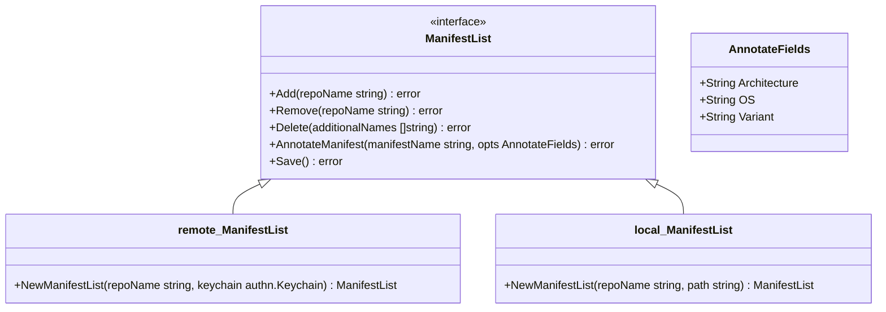

# Meta
[meta]: #meta
- Name: Manifest List Commands for Pack
- Start Date: 2023-04-19
- Author(s): [Juan Bustamante](https://github.com/jjbustamante)
- Status: Draft <!-- Acceptable values: Draft, Approved, On Hold, Superseded -->
- RFC Pull Request: (leave blank)
- CNB Pull Request: (leave blank)
- CNB Issue: (leave blank)
- Supersedes: (put "N/A" unless this replaces an existing RFC, then link to that RFC)

# Summary
[summary]: #summary

The problem for adding support for multi-arch buildpacks can be divided into two parts:
- Support buildpack authors to **migrate their existing buildpacks** to support multi-arch .
- Support buildpack authors to **create new buildpacks and builders** that handle multi-arch from the beginning.

This RFC proposes to create a new set of CRUD commands in pack to handle manifest lists, which will be used to support the first part of the problem.

# Definitions
[definitions]: #definitions

- Image Manifest: The image manifest provides a configuration and set of layers for a single container image for a specific architecture and operating system. See [spec](https://github.com/opencontainers/image-spec/blob/main/manifest.md)
- Image Index: The image index is a higher-level manifest which points to specific image manifests, ideal for one or more platforms. See [spec](https://github.com/opencontainers/image-spec/blob/main/image-index.md) 

# Motivation
[motivation]: #motivation

- Why should we do this?

The uses of ARM architecture in the cloud and edge computing has been growing rapidly. The CNCF community has been also growing in the last years, and there is a need to support multi-arch for all the projects. The buildpacks community is not an exception, issues like:
- [It would be nice to support easily creating a manifest list packages and builders](https://github.com/buildpacks/pack/issues/1460)
- [Provide a way to specify desired platform when creating packages and builders](https://github.com/buildpacks/pack/issues/1459)
- [Multi arch image build support](https://github.com/buildpacks/pack/issues/1570)

Or the conversations around this topic in our [slack channel](https://cloud-native.slack.com/archives/C032LNSMY0P), even the [talk at Kubecon NA 2022](https://www.youtube.com/watch?v=Sdr5axlOnDI&list=PLj6h78yzYM2O5aNpRM71NQyx3WUe1xpTn&index=76) demonstrate the interest from the community in this feature.

- What use cases does it support?

Currently, buildpack authors can build and package their buildpacks for different OS and Architectures, but when they distribute them the URI for a buildpack can’t disambiguate, they need to use different tags to differentiate between them. This makes harder for users to consume those Buildpacks. 
The solution is to share a single URI for all the different OS and Architectures, and the way to do that is using a manifest list.

Adding commands to support the operations to handle the manifest list will allow buildpack authors to migrate their existing buildpacks to support multi-arch, without afecting their current existing process. 

- What is the expected outcome?

The expected outcome is to have a set of commands in pack to handle manifest lists, for example:
- A command to create a manifest list from a set of images
- A command to push the manifest list to a registry
- A command to update or delete a manifest list

# What it is
[what-it-is]: #what-it-is

The proposal is to add a new _experimental_ command `pack manifest` and different subcommands.   The `pack manifest` commands will initially be gated behind `pack config experimental`.  The `pack manifest` commands will move from experimental status to supported status when maintainers deem it appropriate.
- `pack manifest create` will create a local manifest list for annotating and pushing to a registry
- `pack manifest annotate` will add additional information like os, arch or variant to an existing local manifest list
- `pack manifest add` will add an image to an existing manifest list
- `pack manifest delete` will delete a manifest list from local storage
- `pack manifest rm` will remove an image from a manifest list
- `pack manifest push` will push a manifest list to a registry
- `pack manifest inspect` will show the manifest information stored in local storage

Our target user affected by the feature is: **Buildpack Authors**. Let's see some examples of how this feature will work. 

Currently, if we check [sample-packages](https://hub.docker.com/r/cnbs/sample-package/tags) at dockerhub we will notice that we have a composed buildpack called `hello-universe` and we offer two tags to support different architectures: 
- `cnbs/sample-package:hello-universe` for linux and 
- `cnbs/sample-package:hello-universe-windows`. 

Let's suppose our linux version is called `cnbs/sample-package:hello-universe-linux` to keep the same naming convention, but we will keep it as it is for simplicity. If we want to distribute the `hello-universe` buildpack for any **architecture/os/variant** combination we need to use a tool outside the CNB ecosystem to create a manifest list. With the proposed experimental commands on pack we can do:

```bash
$ pack manifest create cnbs/sample-package:hello-multiarch-universe \ 
     cnbs/sample-package:hello-universe \ 
     cnbs/sample-package:hello-universe-windows
```

By default, the command will create a manifest list in the local storage using the docker media types [Version 2 schema 2](https://docs.docker.com/registry/spec/manifest-v2-2/) with a content similar to:

```json
{
   "schemaVersion": 2,
   "mediaType": "application/vnd.docker.distribution.manifest.list.v2+json",
   "manifests": [
      {
         "mediaType": "application/vnd.docker.distribution.manifest.v2+json",
         "size": 226083,
         "digest": "sha256: 87a832fd6a8d6995d336c740eb6f3da015401a6e564fcbe95ee1bf37557a8225",
         "platform": {
            "os": "linux",
           "architecture": ""
         }
      },
      {
         "mediaType": "application/vnd.docker.distribution.manifest.v2+json",
         "size": 226083,
         "digest": "sha256:670d62fbee841d256a706801a03be9c84d37fc2cd6ef7538a7af9985c3d2ed8b",
         "platform": {
            "os": "windows",
           "architecture": ""
         }
      }   
   ]
}
```
The idea to save the manifest list locally is to allow the user to update the manifest before pushing it to a registry, 
in this case, we need to define the **architecture** field because it is empty in our examples.

We can use the `pack manifest annotate` command to add the architecture information:

```bash
$  pack manifest annotate --arch amd64 cnbs/sample-package:hello-multiarch-universe cnbs/sample-package:hello-universe
$  pack manifest annotate --arch amd64 cnbs/sample-package:hello-multiarch-universe cnbs/sample-package:hello-universe-windows
```

After executing these commands, our local manifest list will be updated as follows:

```json
{
  "schemaVersion": 2,
  "mediaType": "application/vnd.docker.distribution.manifest.list.v2+json",
  "manifests": [
    {
      "mediaType": "application/vnd.docker.distribution.manifest.v2+json",
      "size": 940,
      "digest": "sha256:87a832fd6a8d6995d336c740eb6f3da015401a6e564fcbe95ee1bf37557a8225",
      "platform": {
        "architecture": "amd64",
        "os": "linux"
      }
    },
    {
      "mediaType": "application/vnd.docker.distribution.manifest.v2+json",
      "size": 1148,
      "digest": "sha256:670d62fbee841d256a706801a03be9c84d37fc2cd6ef7538a7af9985c3d2ed8b",
      "platform": {
        "architecture": "amd64",
        "os": "windows"
      }
    }
  ]
}
```

Finally, our manifest list is ready to be pushed to a registry, and we can use the `pack manifest push` command to do it:

```bash
$ pack manifest push cnbs/sample-package:hello-multiarch-universe
```
And our manifest list should be published at [dockerhub](https://hub.docker.com/r/cnbs/sample-package/tags) as `cnbs/sample-package:hello-multiarch-universe`, asuming that we have the proper credentials to push the image.

<!--
This provides a high level overview of the feature.

- Define any new terminology.
- Define the target persona: buildpack author, buildpack user, platform operator, platform implementor, and/or project contributor.
- Explaining the feature largely in terms of examples.
- If applicable, provide sample error messages, deprecation warnings, or migration guidance.
- If applicable, describe the differences between teaching this to existing users and new users.
-->

# How it Works
[how-it-works]: #how-it-works

The proposal is to implement an abstraction of an OCI *Image Index* and expose it to users through `pack manifest` commands.

## Image Index Abstraction

A new high level abstraction to represent an OCI Image Index is proposed, similar to the [Image](https://github.com/buildpacks/imgutil/blob/main/image.go) interface exposed in *imgutil* repository, 
we proposed a new *ManifestList* interface to expose the behavior of an OCI Image Index.



Two implementations: *remote* and *local* are proposed, *remote* will take care of implementing the interaction with an OCI registry and *local* will deal with the local storage operations.

### Component Diagram

Using a [C4 component diagram](https://c4model.com/#ComponentDiagram), we can define the high level interaction on pack. This design follows the same pattern for each command already implemented.


- *Image Factory*: is responsible for instantiate the *Image Index* abstraction based on the configuration require, it could be a *remote* or a *local* implementation
- *Image Index*: is the abstraction defined which exposes the operation methods we want to offer to users
  - As we can see, depending on the implementation it will interact with the file system or with a remote registry

### Considerations

#### When a user wants to create a manifest list using a manifest outside the user's repo. 

Let's suppose the following user case: A user wants to create a manifest list `foo/my-manifest:my-tag` using a manifest outside his repository `foo` for example `other/external-manifest:latest`. 

In this case, pack will need to *copy* the external manifest `other/external-manifest:latest` into `foo` repository `foo/external-manifest:latest` and then uses this reference into the manifest list created. Pack should at least *warn* the user about this operation.

#### When a user wants to create a manifest list referencing a manifest list


# Migration
[migration]: #migration

This section should document breaks to public API and breaks in compatibility due to this RFC's proposed changes. In addition, it should document the proposed steps that one would need to take to work through these changes. Care should be give to include all applicable personas, such as platform developers, buildpack developers, buildpack users and consumers of buildpack images.

# Drawbacks
[drawbacks]: #drawbacks

Why should we *not* do this?

We should decide to do not add this feature and users could use tools like `docker` or `podman` to create and handle their manifest list, however this is a poor user experience forcing users to use different tools to fulfill scenarios that are part of the business domain of pack.

# Alternatives
[alternatives]: #alternatives

- What other designs have been considered?

We also have in mind to improve existing commands like `pack builder create` and `pack buildpack package` to support the creation of a manifest list without the need of a new command. However, this approach could not be suitable for buildpack authors who are maintaining existing buildpacks and they will need to change their current process to generate multi-arch images.

- Why is this proposal the best?

Because we will provide the tool to our end users to solve their problems without the need of using other tools.

- What is the impact of not doing this?

The impact of not doing this is that users will need to use other tools to create and handle their manifest list, which is a poor user experience.

# Prior Art
[prior-art]: #prior-art

These features are inspired in similar commands in other tools like:
- [docker](https://docs.docker.com/engine/reference/commandline/manifest/) 
- [podman](https://docs.podman.io/en/v3.2.0/markdown/podman-manifest-create.1.html)

# Unresolved Questions
[unresolved-questions]: #unresolved-questions

- What parts of the design do you expect to be resolved before this gets merged?
- What parts of the design do you expect to be resolved through implementation of the feature?
- What related issues do you consider out of scope for this RFC that could be addressed in the future independently of the solution that comes out of this RFC?

# Spec. Changes (OPTIONAL)
[spec-changes]: #spec-changes
Does this RFC entail any proposed changes to the core specifications or extensions? If so, please document changes here.
Examples of a spec. change might be new lifecycle flags, new `buildpack.toml` fields, new fields in the buildpackage label, etc.
This section is not intended to be binding, but as discussion of an RFC unfolds, if spec changes are necessary, they should be documented here.

# History
[history]: #history

<!--
## Amended
### Meta
[meta-1]: #meta-1
- Name: (fill in the amendment name: Variable Rename)
- Start Date: (fill in today's date: YYYY-MM-DD)
- Author(s): (Github usernames)
- Amendment Pull Request: (leave blank)

### Summary

A brief description of the changes.

### Motivation

Why was this amendment necessary?
--->
