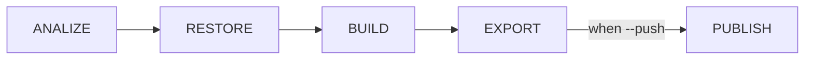

# Meta
[meta]: #meta
- Name: Publish Operation
- Start Date: 2022-02-22
- Author(s): Juan Bustamante (@jbustamante)
- Status: Draft <!-- Acceptable values: Draft, Approved, On Hold, Superseded -->
- RFC Pull Request: (leave blank)
- CNB Pull Request: (leave blank)
- CNB Issue: (leave blank)
- Supersedes: (put "N/A" unless this replaces an existing RFC, then link to that RFC)

# Summary
[summary]: #summary

Split the process of creating and saving the Image in two different operations.
- Export: will create the Image and saves it to disk in [OCI Layout](https://github.com/opencontainers/image-spec/blob/main/image-layout.md) format. When the `daemon` flag is enabled it could save all the metadata that can't be saved into the daemon in a separate report.
- Publish: will take the image generated by Export and push it into the Daemon or in the Registry.

# Definitions
[definitions]: #definitions

- A [Platform](https://buildpacks.io/docs/concepts/components/platform/) uses a lifecycle, Buildpacks (packaged in a builder), and application source code to produce an OCI image.
- A [Lifecycle](https://buildpacks.io/docs/concepts/components/lifecycle/) orchestrates Buildpacks execution, then assembles the resulting artifacts into a final app image.
- A Daemon is a service, popularized by Docker, for downloading container images, and executing and managing containers from those images.
- A Registry is a long-running service used for storing and retrieving container images.
- An [OCI Image Layout](https://github.com/opencontainers/image-spec/blob/main/image-layout.md) is the directory structure for OCI content-addressable blobs and location-addressable references.
- An [image index](https://github.com/opencontainers/image-spec/blob/main/image-index.md) is a higher-level manifest which points to a list of manifests and descriptors.
- An [Image manifest](https://github.com/opencontainers/image-spec/blob/main/manifest.md) provides a configuration and set of layers for a single container image for a specific architecture and operating system.
- A [config](https://github.com/opencontainers/image-spec/blob/main/descriptor.md) is a property references a configuration object for a container, by digest. It must support the following media type `application/vnd.oci.image.config.v1+json`

# Motivation
[motivation]: #motivation

Because the [Image.Digest](https://pkg.go.dev/github.com/google/go-containerregistry/pkg/v1#Image) method from the GCR library would compute the Digest value before pushing it to a Registry, it allows us to create the image and add  metadata require like annotations or even sign it and save it to disk and be sure that when the Image is push to the registry the Digest will not change. (See the [thread](https://cloud-native.slack.com/archives/C033DV9EBDF/p1644523524402149) on Slack).

<!-- - Why should we do this? -->
<!-- - What use cases does it support? -->

We should do this to unblock uses cases like

- OCI annotations. See [RFC](https://github.com/buildpacks/rfcs/pull/196)
- Cosign integration. See [RFC](https://github.com/buildpacks/rfcs/pull/195)

<!-- - What is the expected outcome? -->

We expect the `Export` phase to save the Image in disk in [OCI Image Layout](https://github.com/opencontainers/image-spec/blob/main/image-layout.md) format and the `Publish` operation to push it to Daemon or Registry.

<!--
 Cosign integration, for example, if a Developer creates his application image using a Platform tool like Pack and sign this image, they expect to push it to a registry a keep the sign. Currently this is not possible,

- Implement an export phase with an standard output format (OCI Layout) that can be consumed by `Platforms` if they want to
- Keep consistency with the push operation behavior because the digest and the metadata can be saved linked to the Manifest
- Solve unsupported metadata cases by the Daemon, because we can save this information in a custom format together with the Image exported in OCI Layout

-->

# What it is
[what-it-is]: #what-it-is

An new operation called *Publish* will be added in the Lifecycle. `/cnb/lifecycle/publisher` is responsibly for pushing the Image into the Daemon or into an OCI Registry.

The *Export* phase will be modify to save the image on disk in a path defined by **Platform**, in case of **Pack**, for example, the image would be saved in a shared volume in the same way it's done right now,  [OCI Image Layout](https://github.com/opencontainers/image-spec/blob/main/image-layout.md) format could be used to save the Image on disk.

Check the following image for a visual representation of the idea.

<!--
This provides a high level overview of the feature.

- Define any new terminology.
- Define the target persona: buildpack author, buildpack user, platform operator, platform implementor, and/or project contributor.
- Explaining the feature largely in terms of examples.
- If applicable, provide sample error messages, deprecation warnings, or migration guidance.
- If applicable, describe the differences between teaching this to existing users and new users.

The `Publish` operation could be invoke in two different ways

| How to invoke Publish      | Description |
| ----------- | ----------- |
| From the Creator   | using a new flag `--push`  |
| Directly from a new `publish` binary    |       |

When it's invoke from the Creator the current workflow is not affected because after

-->

# How it Works
[how-it-works]: #how-it-works

<!--
This is the technical portion of the RFC, where you explain the design in sufficient detail.

The section should return to the examples given in the previous section, and explain more fully how the detailed proposal makes those examples work.

-->

# Migration
[migration]: #migration

<!--
This section should document breaks to public API and breaks in compatibility due to this RFC's proposed changes. In addition, it should document the proposed steps that one would need to take to work through these changes. Care should be give to include all applicable personas, such as platform developers, buildpack developers, buildpack users and consumers of buildpack images.
-->
# Drawbacks
[drawbacks]: #drawbacks

Why should we *not* do this?

# Alternatives
[alternatives]: #alternatives

- What other designs have been considered?
- Why is this proposal the best?
- What is the impact of not doing this?

# Prior Art
[prior-art]: #prior-art

Discuss prior art, both the good and bad.

# Unresolved Questions
[unresolved-questions]: #unresolved-questions

- What parts of the design do you expect to be resolved before this gets merged?
- What parts of the design do you expect to be resolved through implementation of the feature?
- What related issues do you consider out of scope for this RFC that could be addressed in the future independently of the solution that comes out of this RFC?

# Spec. Changes (OPTIONAL)
[spec-changes]: #spec-changes
Does this RFC entail any proposed changes to the core specifications or extensions? If so, please document changes here.
Examples of a spec. change might be new lifecycle flags, new `buildpack.toml` fields, new fields in the buildpackage label, etc.
This section is not intended to be binding, but as discussion of an RFC unfolds, if spec changes are necessary, they should be documented here.
