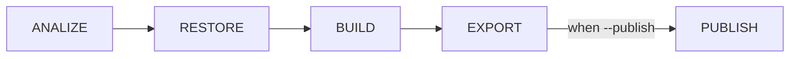

# Meta
[meta]: #meta
- Name: Publish Operation
- Start Date: 2022-02-22
- Author(s): Juan Bustamante (@jbustamante)
- Status: Draft <!-- Acceptable values: Draft, Approved, On Hold, Superseded -->
- RFC Pull Request: (leave blank)
- CNB Pull Request: (leave blank)
- CNB Issue: (leave blank)
- Supersedes: (put "N/A" unless this replaces an existing RFC, then link to that RFC)

# Summary
[summary]: #summary

Split the process of generating and saving it into the final destination in two different operations.
- Export: will create the image and saving it to disk in OCI layout format. When the `daemon` flag is enabled it will save all the metadata that can't be saved into the daemon in a separate report
- Publish: will take the image generated by Export and save it into the Daemon or in the Registry using the metadata report when it's necessary.

# Definitions
[definitions]: #definitions
<!--
Make a list of the definitions that may be useful for those reviewing. Include phrases and words that buildpack authors or other interested parties may not be familiar with.
-->

# Motivation
[motivation]: #motivation

<!-- - Why should we do this? -->

Because the [Image.Digest](https://pkg.go.dev/github.com/google/go-containerregistry/pkg/v1#Image) method from the GCR library would compute the value before pushing it to a Registry, we can be sure to create the Image and add all the metadata require (annotations, cosign, etc) save it to disk and be sure that when the image is push to the registry the Image Digest will not change. (See the [thread](https://cloud-native.slack.com/archives/C033DV9EBDF/p1644523524402149) on Slack)

Splitting the creation of the image and it's saving operation in two different process allows us the following:
- Implement an export phase with an standard output format (OCI Layout) that can be consumed by `Platforms` if they want to
- Keep consistency with the push operation behavior because the digest and the metadata can be saved linked to the Manifest
- Solve unsupported metadata cases by the Daemon, because we can save this information in a custom format together with the Image exported in OCI Layout

<!-- - What use cases does it support? -->
We can support the use cases:

- OCI annotations. See [RFC](https://github.com/buildpacks/rfcs/pull/196)
- Cosign integration. See [RFC](https://github.com/buildpacks/rfcs/pull/195)

<!-- - What is the expected outcome? -->

# What it is
[what-it-is]: #what-it-is

The idea is to modify the existing *Export* phase to save the image on disk in a path defined by **Platform**, in case of **Pack** the image
would be saved in a volumen shared by other phases,  OCI Layout forma will be used to saved the image and a new operation called *Publish*
will be created. This operation will be invoked when the a new flag `--publish` is sent to Lifecycle and it will actually load
the image from disk generated by the export phase and then push to Daemon or Registry.

Check the following image for a visual representation of the idea.

<!--
This provides a high level overview of the feature.

- Define any new terminology.
- Define the target persona: buildpack author, buildpack user, platform operator, platform implementor, and/or project contributor.
- Explaining the feature largely in terms of examples.
- If applicable, provide sample error messages, deprecation warnings, or migration guidance.
- If applicable, describe the differences between teaching this to existing users and new users.

-->

# How it Works
[how-it-works]: #how-it-works

<!--
This is the technical portion of the RFC, where you explain the design in sufficient detail.

The section should return to the examples given in the previous section, and explain more fully how the detailed proposal makes those examples work.

-->

# Migration
[migration]: #migration

<!--
This section should document breaks to public API and breaks in compatibility due to this RFC's proposed changes. In addition, it should document the proposed steps that one would need to take to work through these changes. Care should be give to include all applicable personas, such as platform developers, buildpack developers, buildpack users and consumers of buildpack images.
-->
# Drawbacks
[drawbacks]: #drawbacks

Why should we *not* do this?

# Alternatives
[alternatives]: #alternatives

- What other designs have been considered?
- Why is this proposal the best?
- What is the impact of not doing this?

# Prior Art
[prior-art]: #prior-art

Discuss prior art, both the good and bad.

# Unresolved Questions
[unresolved-questions]: #unresolved-questions

- What parts of the design do you expect to be resolved before this gets merged?
- What parts of the design do you expect to be resolved through implementation of the feature?
- What related issues do you consider out of scope for this RFC that could be addressed in the future independently of the solution that comes out of this RFC?

# Spec. Changes (OPTIONAL)
[spec-changes]: #spec-changes
Does this RFC entail any proposed changes to the core specifications or extensions? If so, please document changes here.
Examples of a spec. change might be new lifecycle flags, new `buildpack.toml` fields, new fields in the buildpackage label, etc.
This section is not intended to be binding, but as discussion of an RFC unfolds, if spec changes are necessary, they should be documented here.
