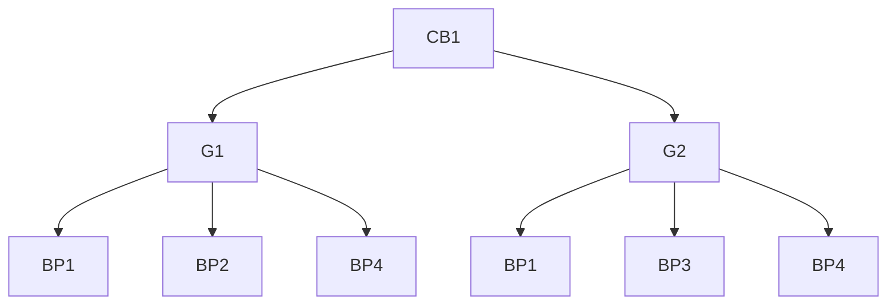
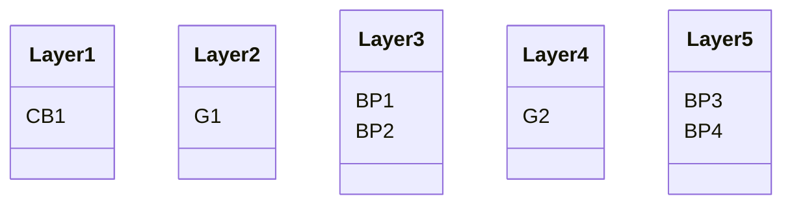

# Meta
[meta]: #meta
- Name: Flatten builders
- Start Date: 2023-07-13
- Author(s): @jjbustamante, @dlion
- Status: Approved
- RFC Pull Request: (leave blank)
- CNB Pull Request: (leave blank)
- CNB Issue: (leave blank)
- Supersedes: (put "N/A" unless this replaces an existing RFC, then link to that RFC)

# Summary
[summary]: #summary

We propose to add new capabilities to the Pack tool that allow end-users to reduce the number of Buildpack's layers in a Builder by flattening some Buildpacks according to their requirements.

This RFC mainly focus on applying this strategy to Builders only.

# Definitions
[definitions]: #definitions

- Buildpack: A buildpack is a set of executables that inspects your app source code and creates a plan to build and run your application.
- Builder: A builder is an image that contains all the components necessary to execute a build. A builder image is created by taking a build image and adding a lifecycle, buildpacks, and files that configure aspects of the build including the buildpack detection order and the location(s) of the run image
- Component Buildpack: A component buildpack is a buildpack containing `/bin/detect` and `/bin/build` executables. Component buildpacks implement the [Buildpack Interface](https://github.com/buildpacks/spec/blob/main/buildpack.md).
- Composite Buildpack: A composite buildpack is a buildpack containing an order definition in `buildpack.toml`. Composite buildpacks do not contain `/bin/detect` or `/bin/build` executables. They MUST be [resolvable](https://github.com/buildpacks/spec/blob/main/buildpack.md#order-resolution) into a collection of component buildpacks.
- Buildpackage: A buildpackage is a [distributable](https://github.com/buildpacks/spec/blob/main/distribution.md) artifact that contains a buildpack.

# Motivation
[motivation]: #motivation

- Why should we do this?

There is a limit in the number of layer an image can have, at least on Docker, which is *127*, this feature has being request by the community, issue [#1595](https://github.com/buildpacks/pack/issues/1595), as a workaround to solve error thrown by docker when the limit is reached

- What use cases does it support?

Buildpacks provider like Paketo have Composite Buildpacks with several layers, when they pull many of those together into a Builder, hitting the layer limit for a container image happens very often. A feature for the Builder author to group the Buildpacks by any attribute will allow them to squash those groups into one layer and reduce their total number of layers, avoiding the layer limit.

- What is the expected outcome?

When Builder Authors execute the command:

`pack builder create ... <flatten options>`

The final Builder (A) SHOULD contain layers blobs with more than *one* buildpack according to the configuration provided by the user. If we compare an artifact (B) created *without* `<flatten options>` then:

$numberOfBuildpackLayers(A) \leq numberOfBuildpackLayers(B)$

A and B MUST be otherwise interchangeable, only differing by their number of layers.


# What it is
[what-it-is]: #what-it-is

The proposal is to include a new experimental flag to the following command on Pack:

- `pack builder create`

The new flag will move from experimental status to supported status when maintainers deem it appropriate.

The new flag to be included is:

- `--flatten=<buildpacks>` will flatten the Buildpacks specified after the `flatten` flag into a single layer. Can be used more than once, with each use resulting in a single layer.

We also need to define how a Platform implementor needs to consume a flattened Builder.

- When a Platform consumes a Builder, they will need to inspect each Buildpack layer blob and determine if the blob contains more than one Buildpack, in such as case, they will need to process those Buildpacks correctly.


# How it Works
[how-it-works]: #how-it-works

Let's say we have a Composite Buildpack (CB1) with the following dependency tree:


Until now, when a Buildpack like this is being shipped into a Builder every individual Buildpack is being saved in one layer, as a result we will have:

$$
layer_1 = [CB_1] \\
layer_2 = [G_1] \\
layer_3 = [BP_1] \\
layer_4 = [BP_2] \\
layer_5 = [BP_4] \\
layer_6 = [G_2] \\
layer_7 = [BP_3] \\
total = \text{7 layers}
$$

Noticed that duplicated Buildpacks are cleaned up.

We can use the new `flatten` flag to reduce the number of Builder layers used by the buildpacks in different ways.

* `--flatten=<buildpacks>` i.e. `--flatten=<BP1,BP2> --flatten=<BP3,BP4>`:
  Will group the given Buildpacks into one layer and keep the other ones as single layers Buildpacks, the result will be:




$$
total = \text{5 layers}
$$

---


# Migration
[migration]: #migration


The current [distribution spec](https://github.com/buildpacks/spec/blob/main/distribution.md#buildpackage) defines:

```
Each buildpack layer blob MUST contain a single buildpack at the following file path:

/cnb/buildpacks/<buildpack ID>/<buildpack version>/
```

A Builder flattened with this new feature would not be consumable by older platform implementations because they are not expecting to find more than one buildpack on a blob layer.


<!--
This section should document breaks to public API and breaks in compatibility due to this RFC's proposed changes. In addition, it should document the proposed steps that one would need to take to work through these changes. Care should be give to include all applicable personas, such as platform developers, buildpack developers, buildpack users and consumers of buildpack images.
-->
# Drawbacks
[drawbacks]: #drawbacks

Why should we *not* do this?

It could create artifacts that are not consumable by older platforms.


# Alternatives
[alternatives]: #alternatives

- What other designs have been considered?

Some other alternatives mentioned are: squashing by the buildpack size or squashing a CNB Builder when the number of layers is reaching the limit, but those ideas, do not provide the freedom to the buildpacks authors to decide which buildpacks to flatten.


- Why is this proposal the best?

Not sure if it is the best, but a way to solve the `layer limit error` is to optimize the uses of the layer in a Builder.

- What is the impact of not doing this?

Builder Authors and Platform Operators will keep seeing the layer limit error.

# Prior Art
[prior-art]: #prior-art

Discuss prior art, both the good and bad.

---

<!--
- What parts of the design do you expect to be resolved through implementation of the feature?
- What related issues do you consider out of scope for this RFC that could be addressed in the future independently of the solution that comes out of this RFC?

-->

# Spec. Changes (OPTIONAL)
[spec-changes]: #spec-changes

No spec changes at this time

<!--
Does this RFC entail any proposed changes to the core specifications or extensions? If so, please document changes here.
Examples of a spec. change might be new lifecycle flags, new `buildpack.toml` fields, new fields in the buildpackage label, etc.
This section is not intended to be binding, but as discussion of an RFC unfolds, if spec changes are necessary, they should be documented here.

-->

# History
[history]: #history

<!--
## Amended
### Meta
[meta-1]: #meta-1
- Name: (fill in the amendment name: Variable Rename)
- Start Date: (fill in today's date: YYYY-MM-DD)
- Author(s): (Github usernames)
- Amendment Pull Request: (leave blank)

### Summary

A brief description of the changes.

### Motivation

Why was this amendment necessary?
--->%
